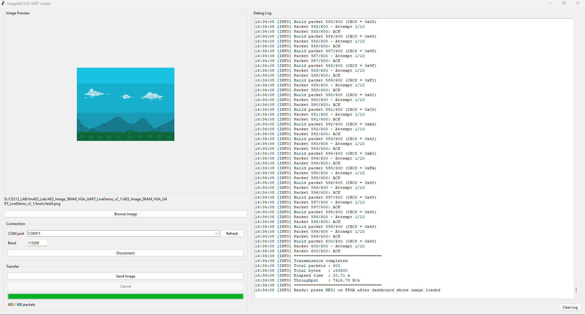
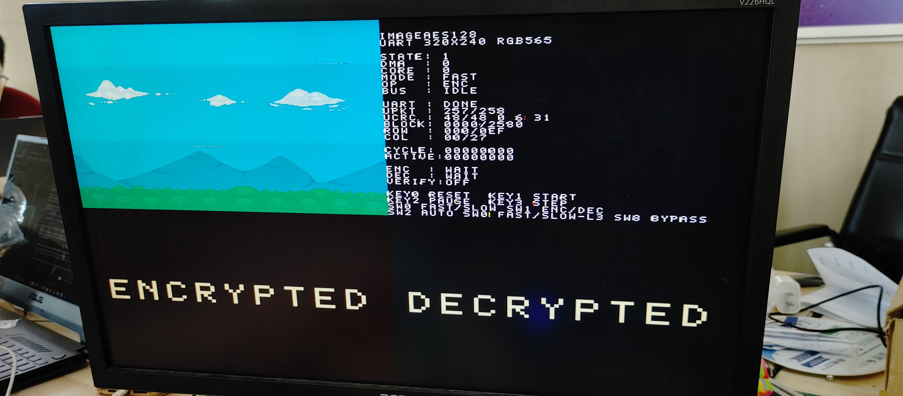
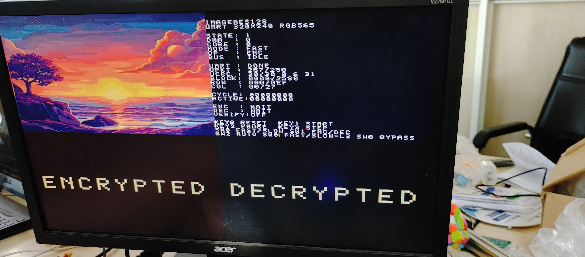
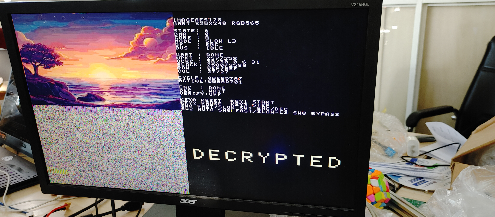
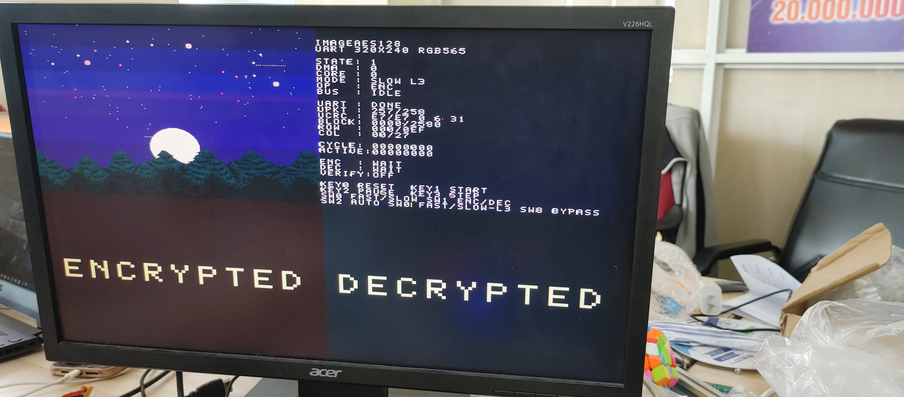
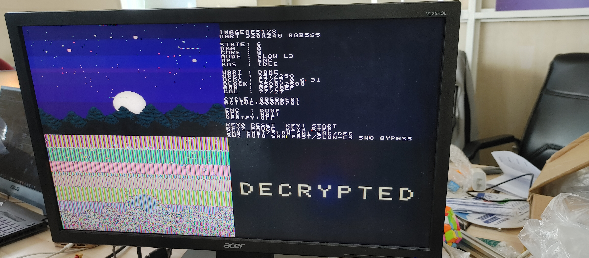
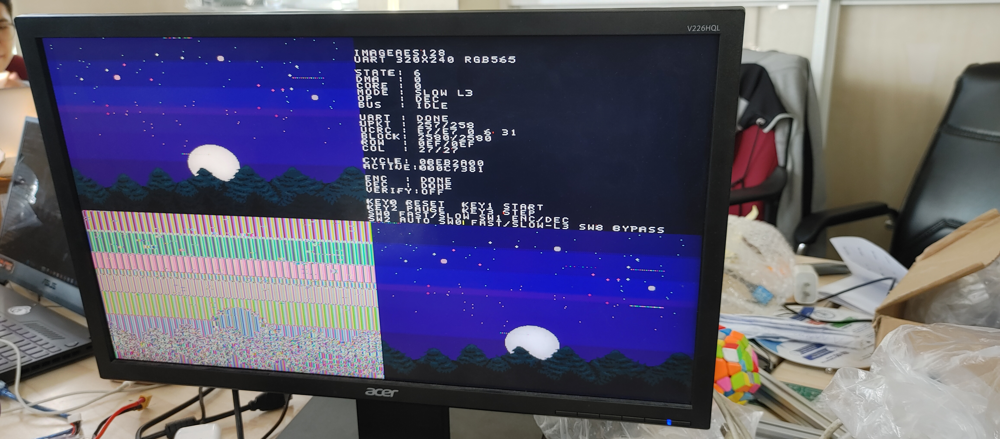

# AES4Img - Verilog AES-128 Image Encryption on FPGA

AES4Img là demo mã hóa/giải mã ảnh RGB565 bằng AES-128 trên FPGA. Hệ thống nhận ảnh 320x240 từ PC qua UART, ghi vào external SRAM, xử lý từng block AES 128-bit bằng DMA, rồi hiển thị đồng thời ảnh gốc, ảnh mã hóa, ảnh giải mã và dashboard debug lên VGA 640x480.



## Điểm nổi bật

- AES-128 encryption/decryption giữ nguyên core Verilog gốc, bọc lại bằng interface IP `start/busy/done`.
- Ảnh đầu vào cố định 320x240 RGB565, mỗi pixel là 1 word SRAM 16-bit.
- Mỗi block AES 128-bit chứa 8 pixel RGB565, toàn ảnh có 9,600 block.
- External SRAM chia 3 vùng: ảnh gốc, ảnh mã hóa, ảnh giải mã.
- VGA 640x480 chia 4 quadrant 320x240: `ORIG`, `DASHBOARD`, `ENC`, `DEC`.
- UART/RS232 loader nhận 600 packet từ PC, có ACK/NACK và CRC8.
- Chỉ giữ 2 top-level chính: `top_de.v` cho DE2 thật và `top.v` cho smoke-test/debug.
- Static website GitHub Pages đã được chuẩn bị tại `index.html`.

## Kết quả demo

| Test | Ảnh đã load | Ảnh sau AES encrypt | Ảnh sau AES decrypt |
|---|---|---|---|
| 0 |  |  |  |
| 1 |  |  |  |
| 2 |  |  |  |

## Kiến trúc nhanh

```text
PC image
  -> tools/send_image_packet_2.py
  -> UART packet 0xAA + 256 bytes + CRC8
  -> uart_image_loader_320x240
  -> SRAM[ADDR_ORIG]
  -> aes_sram_dma_320x240
  -> aes128_core_wrapper
  -> SRAM[ADDR_ENC] / SRAM[ADDR_DEC]
  -> VGA quadrant renderer + text dashboard
```

SRAM address map:

```verilog
ADDR_ORIG = 18'h00000; // 0x00000..0x12BFF
ADDR_ENC  = 18'h14000; // 0x14000..0x26BFF
ADDR_DEC  = 18'h28000; // 0x28000..0x3ABFF
```

Mỗi vùng ảnh cần `320 * 240 = 76,800` word 16-bit. Khoảng trống giữa các vùng giúp debug địa chỉ dễ hơn.

## Cấu trúc thư mục

```text
rtl/
  aes_core/      AES core gốc và wrapper start/busy/done
  control/       FSM điều khiển demo, input KEY/SW, UART profile
  dma/           ROM loader và AES/SRAM DMA 320x240
  rom/           ROM ảnh RGB565 cho mô phỏng hoặc FPGA đủ RAM
  sram/          SRAM PHY và arbiter 2-master/3-master
  uart/          UART RX/TX, packet CRC8, SRAM packet writer
  vga/           VGA timing, SRAM reader, quadrant renderer, dashboard
sim/
  models/        SRAM model và AES mock core
  scripts/       ModelSim compile/run script
  tb/            Self-checking testbench
tools/           Công cụ convert ảnh và gửi ảnh qua UART
quartus/         Project Quartus II cho Cyclone II / DE2-style board
docs/            Tài liệu kiến trúc, UART, test plan, GitHub Pages
assets/          Ảnh minh họa và kết quả test dùng cho README/website
legacy/          Source cũ để đối chiếu, không compile trong project chính
legacy_uart/     UART thử nghiệm cũ để tham khảo, không compile trong project chính
```

## Top-level chính

| Top-level | Khi dùng | Ghi chú |
|---|---|---|
| `rtl/top_de.v` | Demo thật với PC gửi ảnh qua UART | Khuyến nghị. Quartus entity là `top_de`. |
| `rtl/top.v` | Smoke-test, testbench và debug | Dùng `image_rom_320x240_rgb565.v` đọc file HEX, có parameter để rút nhỏ ảnh khi mô phỏng. |

## Chạy demo UART trên board

1. Mở `quartus/AES4Img.qpf` bằng Quartus II.
2. Kiểm tra `TOP_LEVEL_ENTITY` trong QSF đang là `top_de`.
3. Compile project và nạp `.sof` lên FPGA.
4. Kết nối VGA monitor và UART/RS232 adapter.
5. Cài dependency Python trên PC:

```bash
python -m pip install pillow pyserial tkinterdnd2
```

6. Gửi ảnh bằng GUI:

```bash
python tools/send_image_packet_2.py --gui
```

Hoặc gửi bằng CLI:

```bash
python tools/send_image_packet_2.py --path tools/test0.png --port COM3
```

Linux:

```bash
python3 tools/send_image_packet_2.py --path tools/test0.png --port /dev/ttyUSB0
```

7. Chờ dashboard báo image loaded, sau đó nhấn `KEY[1]` để chạy AES.

## Mapping điều khiển

| Tín hiệu | Chức năng |
|---|---|
| `KEY[0]` | Reset active-low |
| `KEY[1]` | Start AES operation sau khi ảnh đã sẵn sàng |
| `KEY[2]` | Pause/resume DMA |
| `KEY[3]` | Reserved/debug step |
| `SW[0]` | `0 = FAST`, `1 = SLOW-L3` |
| `SW[1]` | `0 = ENCRYPT`, `1 = DECRYPT` |
| `SW[2]` | Auto mode: encrypt xong tự chạy decrypt |
| `SW[4:3]` | Không dùng, slow cố định L3 |
| `SW[5]` | Verify marker enable |
| `SW[6]` | Clear status/reload marker |
| `SW[7]` | Reserved/debug pattern |
| `SW[8]` | Bypass UART wait nếu `ADDR_ORIG` đã được preload |

## UART packet format

PC gửi đúng 600 packet:

```text
HEADER : 0xAA
DATA   : 256 bytes
CRC8   : 1 byte, polynomial 0x07, init 0xFF, tính trên DATA
ACK    : 0x06
NACK   : 0x15
```

Ảnh có `320 * 240 * 2 = 153,600` byte. Mỗi packet chứa 256 byte, tương đương 128 pixel RGB565. Byte order là high byte trước, low byte sau.

## Tạo ảnh HEX/MIF cho profile ROM

Nếu cần dùng `rtl/top.v` hoặc mô phỏng ROM ảnh:

```bash
python -m pip install pillow
python tools/convert_image_to_rgb565_hex.py tools/test0.png --out-prefix image_320x240_rgb565
```

File `image_320x240_rgb565.hex` được đọc bằng `$readmemh` trong `rtl/rom/image_rom_320x240_rgb565.v`.

## Chạy simulation bằng ModelSim-Altera

Từ project root:

```tcl
vsim -do sim/scripts/modelsim_compile_functional.do
vsim -do sim/scripts/run_all_selftests.do
```

Mở waveform DMA:

```tcl
vsim -do sim/scripts/modelsim_compile_functional.do
vsim -do sim/scripts/wave_aes_dma.do
```

Các testbench chính:

| Testbench | Mục tiêu |
|---|---|
| `tb_aes128_core_wrapper_selftest.v` | AES-128 known-answer test cho encrypt/decrypt |
| `tb_sram_arbiter_selftest.v` | Kiểm tra priority DMA/VGA |
| `tb_image_loader_selftest.v` | Kiểm tra copy ROM sang SRAM |
| `tb_aes_sram_dma_320x240_selftest.v` | Kiểm tra pack/unpack 8 pixel qua AES DMA |
| `tb_system_smoke_small.v` | Smoke test hệ thống kích thước nhỏ |
| `tb_uart_rx_packet_256_selftest.v` | Kiểm tra UART packet + CRC8 |
| `tb_uart_sram_packet_writer_selftest.v` | Kiểm tra ghi packet 256 byte vào SRAM |

## GitHub Pages

Repo đã có static site ở root:

```text
index.html
styles.css
script.js
.nojekyll
.github/workflows/pages.yml
```

Cách nhanh nhất:

1. Push repo lên GitHub.
2. Vào `Settings -> Pages`.
3. Chọn `Build and deployment -> GitHub Actions`.
4. Workflow `Deploy static site to GitHub Pages` sẽ publish website từ `index.html`, `styles.css`, `script.js`, `assets/` và `docs/`.

Có thể xem thử local bằng cách mở trực tiếp `index.html` trong browser.

## Tài liệu chi tiết

- [Kiến trúc hệ thống](docs/ARCHITECTURE.md)
- [UART image load](docs/UART_IMAGE_LOAD.md)
- [Memory caveat 320x240](docs/MEMORY_CAVEAT_320x240.md)
- [Test plan](docs/TEST_PLAN.md)
- [GitHub Pages setup](docs/GITHUB_PAGES.md)
- [Refactor notes](docs/REFACTOR_NOTES.md)
- [v2.1 UART notes](docs/V2_1_UART_REFACTOR_NOTES.md)

## Lưu ý

- Fast mode ưu tiên throughput AES/DMA; VGA image read có thể bị chặn trong lúc AES chạy.
- Slow-L3 cố tình throttle DMA để VGA có slot đọc SRAM, phù hợp demo trực quan.
- `verify_pass` hiện là marker ở mức hệ thống. Muốn verify phần cứng đầy đủ nên thêm một DMA compare pass đọc `ORIG` và `DEC`.
- Project giữ các thư mục `legacy/` và `legacy_uart/` để đối chiếu, nhưng đường chính hiện tại nằm trong `rtl/`.
